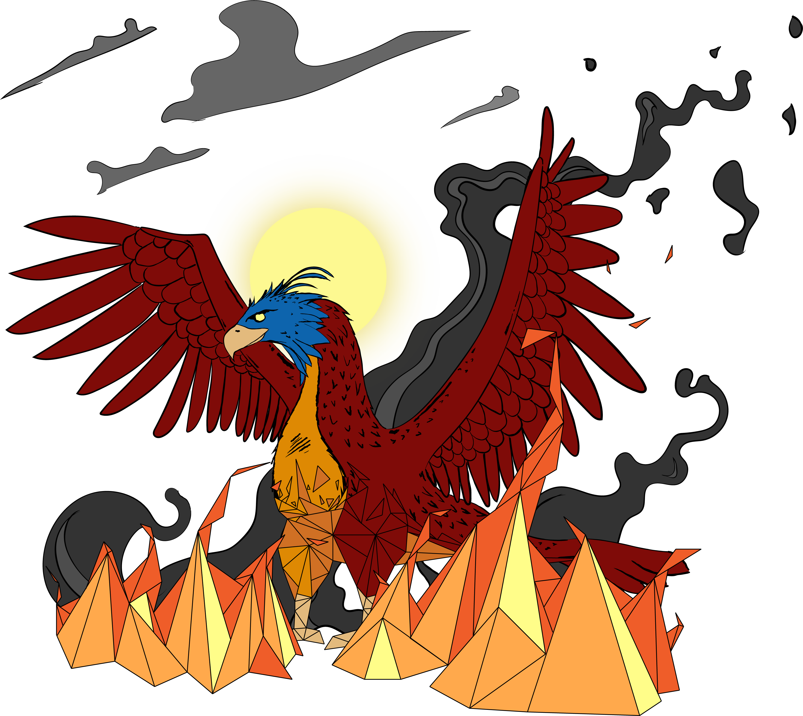

Phoenix
=======

A [MOOSE](https://www.mooseframework.org/) app for radiation heat transfer.

Phoenix deterministically calculates view factors between/of arbitrary geometries. Occlusion and
self-occlusion can be accounted for as the users sees appropriate. A variety of options exist for the users to select between
using (fast, but potentially buggy) floating point numbers or "_exact_" numbers (slow, but avoids bugs common with floating points) as the basis for the view factor computation.

Phoenix provides boundary conditions for:
* Surface averaged, black-body radiation heat transfer (emission and irradiation),
* Element averaged, black-body radiation heat transfer, and
* Local black-body radiation emission.
The computed view factors are directly feed to the boundary conditions that require them.

_Note_: See [CGAL's](https://doc.cgal.org/latest/Manual/tutorial_hello_world.html) documentation
for more information about "_exact_" computation.

Setup
=====

Before compiling Phoenix one should first follow the
[Getting Started](https://www.mooseframework.org/moose/getting_started/index.html)
instructions for MOOSE. Proceed only after the MOOSE environment
is installed.

Phoenix requires a few additional libraries to be installed before it can be
built. Perhaps the simplest way to install the libraries is with miniconda. First
setup a custom conda environment:

    conda create -n phoenix --clone=/opt/moose/miniconda

The new environment then needs to be activated:

    source activate phoenix

Run the following commands to install the dependencies into the phoenix
environment:

    conda install gmp
    conda install mpfr
    conda install boost

This will install the [GNU Multiple Precision Arithmetic Library (GMP)](https://gmplib.org/),
[GNU Multiple Precision Floating-Point Reliably library (GNU MPFR)](http://www.mpfr.org/),
and [Boost](http://www.boost.org/), respectively.
These dependencies are required for the modified version of
[The Computational Geometry Algorithm Library (CGAL)](http://www.cgal.org/)
that is included as a submodule in Phoenix.

After the MOOSE environment is installed, clone Phoenix into the
desired directory:

    git clone https://github.com/andfranklin/Phoenix.git

The submodules (CGAL, MOOSE and transitive submodules) then need to be
initialized and updated:

	cd Phoenix
	git submodule update --init --recursive

Next, the libMesh script must be run (note that MOOSE updates will often require this script to be re-run):

    ./moose/scripts/update_and_rebuild_libmesh.sh

Finally, Phoenix can be built:

    make -j <number of cores>

To avoid getting burned :wink: by Phoenix, verify that everything has been installed properly by running the tests:

	./run_tests

and the unit tests:

	cd unit
	make -j <number of cores>
	./run_tests

_Note_: The phoenix conda-environment must be activated before Phoenix can be compiled.

Update Troubleshooting
======================

Occasionally Phoenix or one of the submodules will need to be updated. If MOOSE is updated and issues arise after
compiling one usually just needs to rerun the libMesh script:

    ./moose/scripts/update_and_rebuild_libmesh.sh
    make -j <number of cores>

If there are still issues then clean all of the directories, re-run the libMesh script and then try to recompile:

	git clean -xfd
	git submodule foreach --recursive git clean -xfd
	./moose/scripts/update_and_rebuild_libmesh.sh
	make -j <number of cores>

_Warning_: This will remove all files that have not been checked-in to git.
